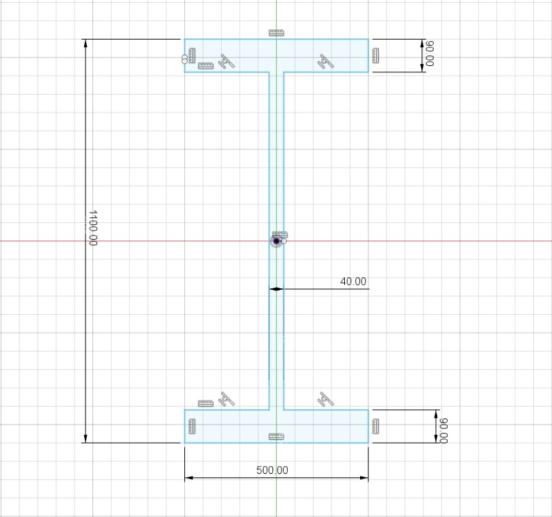
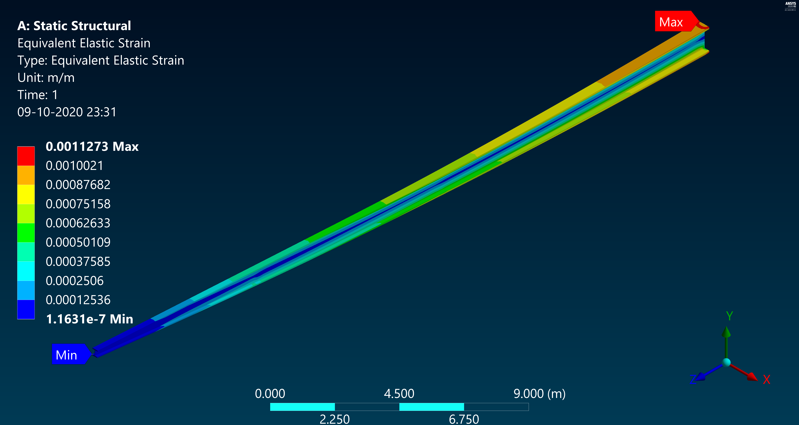

# I beam fatigue life estimator

This project is a python implementation of fatigue life estimation for beams, with varying corss sections like aircraft wing spars. The model is based on SN curves and Minor-damage sum. Loading cycles are counted to approppriate frequencies and cycles with rainflow counting algorithm.

## Pre-calculations
Beam design and cross sections are necessary inputs

### The testcase uses WISPER air load data

### Loading calculations

<i>Meshing the beam for FEM analysis</i>

<i>Load application points</i>

The data needs to be simulated in an FEM software (Ansys Mechanical in this case) to estimate maximum stress and displacement.

#### Von-miesis stress and strain distribution

_Equivalent stress disribution animation_

<i>Von-Miesis stress distribution</i>

<i>Directional deformation</i>

<i>Directional deformation distribution</i>

<i>Equivalanet strain distribution</i>

 
 **Other material parameters are added as inputs in the script.**

 ## Miscallaneous calculations

